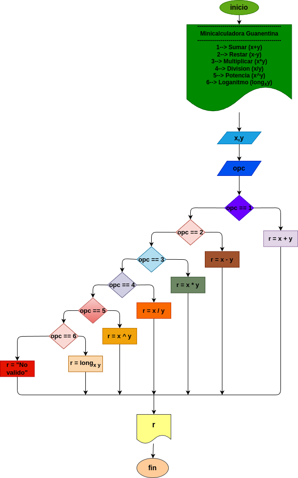

# Mini_Calculadora_Guanentina 

# Calculadora Interactiva en Python

¡Bienvenido a tu Calculadora Interactiva en Python! Este proyecto es una pequeña aplicación en Python que permite realizar varias operaciones matemáticas básicas a través de un menú interactivo.


## Ejemplo de Uso

```
Selecciona una operación:
1. Sumar
2. Restar
3. Multiplicar
4. Dividir
5. Potencia
6. Logaritmo

Introduce el número de la operación (1/2/3/4/5/6): 1
Introduce el primer número: 5
Introduce el segundo número: 3
El resultado de sumar es: 8
```
